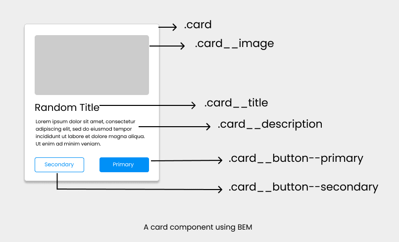

### lesson-3

1. Amaliyot maketi : https://www.figma.com/file/PwxTMd6UVWbdl3fZwcq7JW/Botanical-Garden-(Copy)?type=design&node-id=303%3A2031&mode=design&t=MBIt39zpvmkB3Y8p-1

2. picture -> 
3. BEM ->
4. CSS variables : 

```

:root{
    --bg-main-color:orange;
}

```



